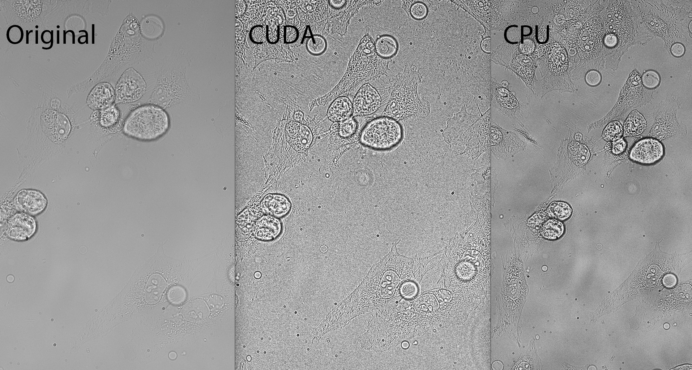
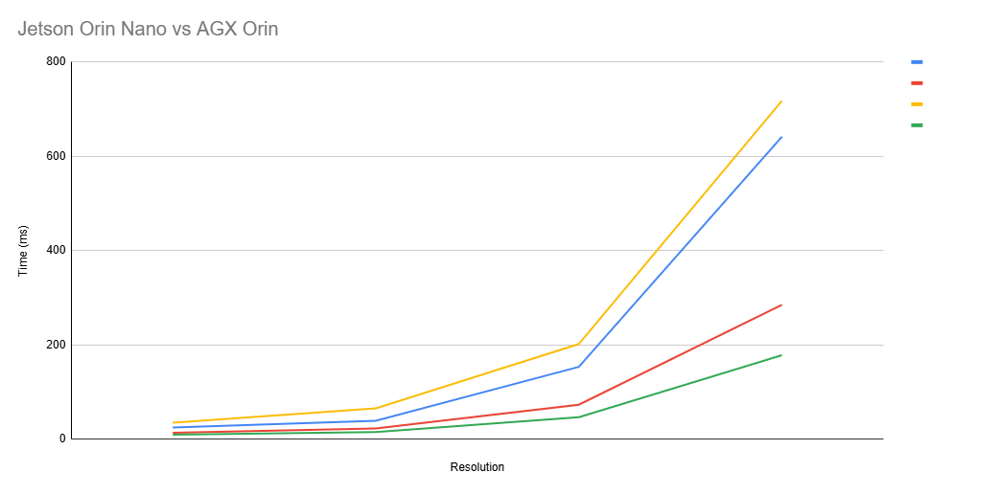
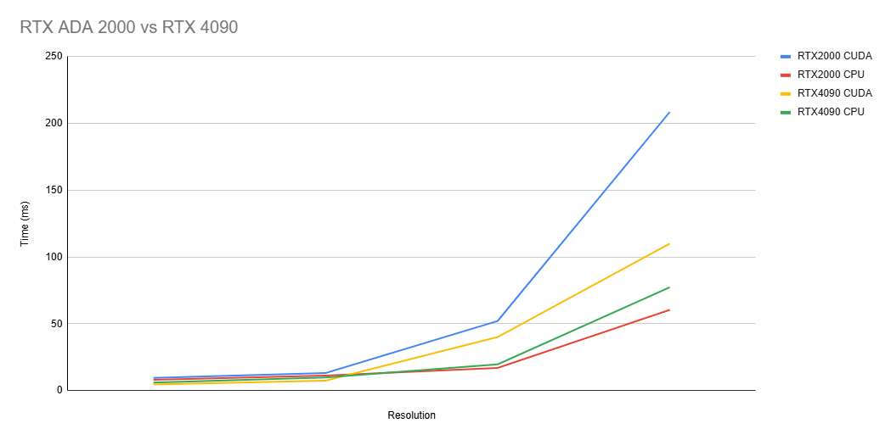

# CUDA CLAHE — Benchmarking & Optimization Notes

Contrast Limited Adaptive Histogram Equalization (CLAHE) accelerated with CUDA, plus a set of micro-benchmarks and experiments exploring performance trade-offs on different GPUs/Jetsons.

---

## Table of contents
- [Introduction](#introduction)
- [Background](#background)
- [Build & run](#build--run)
- [Part 1 — Device benchmarking](#part-1--device-benchmarking)
- [Part 2 — Optimization experiments](#part-2--optimization-experiments)
- [Results gallery](#results-gallery)
- [Reproducing measurements](#reproducing-measurements)
- [Notes on AI usage](#notes-on-ai-usage)
- [License](#license)
- [Appendix — Tuning tips](#appendix--tuning-tips)

---

## Introduction

MetaVi Labs builds microscope software for cell tracking and analysis. As the software displays the images to the user, a series of corrections must be applied to the image. One crucial step in the correction process is contrast enhancement, to provide a clear image with dark cells that pop off of the light background. The contrast algorithm that MetaVi Labs has chosen to utilize is the CLAHE (Contrast-Limited Adaptive Histogram Equalization), which provides an even contrast across the image, with various inputs that allow the contrast and its application to be tuned. CLAHE boosts local contrast without over-amplifying noise.

The Clahe algorithm was chosen for a variety of factors, but partly because the development team at MetaVi labs was able to build their own, proprietary, CLAHE algorithm that could be accelerated via CUDA hardware acceleration. A CUDA path enables near-interactive viewing on supported devices. This project seeks to answer the question: how much faster is MetaVi Lab's proprietary CUDA algorithm when compared to prebuilt, already-optimized, CLAHE algorithms that run on the CPU. In order to fully understand the application-time difference between the CPU and CUDA, the CLAHE algorithms were applied on multiple devices, demonstrating which devices would be most useful for this algorithm. It ought to be noted that the CLAHE algorithm used in this test is not MetaVi's final production algorithm. Rather, the algorithm tested is the prototype program that was characterized as a proof-of-concept program.

This project benchmarks a CUDA implementation of CLAHE to:

- **Quantify speed** across several devices (Jetsons and desktop GPUs),
- **Compare** against OpenCV’s CPU CLAHE,
- and **Explore kernel-level optimizations** to understand whether high-end hardware costs are justified by measurable latency improvements.

---

## Background

### What CLAHE does (and why)
CLAHE is a multi-step process of several key steps. It begins by dividing an image into equal-sized tiles, and it clips each tile’s histogram to a limit (to avoid over-contrast). The excess is then reapplied to histogram, and then the histogram is scaled based off of the histogram's Cummulative Distribution Function. The equalized values are then stored in a LUT (one per tile) to optimize value accessing speeds. Lastly, the whole image is bilinearly interpolated to smooth over tile seams, creating one, cohesive, image.


### OpenCV vs. proprietary flow
Below, we show side-by-side examples using:
**OpenCV CLAHE (CPU)**
and
 **Proprietary/experimental CUDA CLAHE** (this repo).
Two comparisons are shown; the second image below shows the same comparison, only zoomed in.

It may be seen that, by developing a proprietary algorithm, the MetaVi developers where able to fully control how the CLAHE algorithm would be applied. Note how the proprietary CLAHE algorithm is more true to the original image: the background reflects the original with minimal difference, and no lines are overly bold, but the visibility range between each cell is compressed, creating a more even look. In this application, CLAHE functions as a sharpening tool, which is incredibly advantageous when photographing such small subjects, as the difference between focal planes is amplified due to the scale of the cells.

_OpenCV vs Proprietary Algorithms:_




### Why CLAHE (for our use-case)
To demonstrate why contast adjustment, visually, is the right strategy to use, we compare CLAHE with Canny Edge Detection. Canny Edge Detection may seem like an attractive option to clearly present harsh lines on a light background to the viewer, but, as seen below, edge detection performs a very different role from contrast adjustment, even in a high-contrast, black-and-white, image.
Canny edge detection can look appealing on greyscale imagery, but it extracts edges, not contrast, preventing it from being a drop-in for improving overall visibility.

_Canny Applied:_


---

## Build & run

### Requirements
- CUDA toolkit (matching your device)
- CMake ≥ 3.16
- A recent C++ compiler
- OpenCV (core, imgproc, imgcodecs, highgui, videoio)
- (Optional) libpng / libjpeg if your build uses them

### Configure & build
```bash
# From repo root
mkdir -p build && cd build
cmake ..           # add -DCMAKE_BUILD_TYPE=Release for optimized builds
cmake --build . -j
```

### Run
```bash

./test
# The binary prints four CUDA timings (in ms) and four CPU timings (in µs) per run.
```

---

## Part 1 — Device benchmarking

In the first part of this expiriement, the application speed of the OpenCV CPU and MetaVi CUDA CLAHE algorithms were compared across four devices and four image sizes. Each test consisted of 10 trials of each method of CLAHE application, on each image size, on each device. The following four devices were compared: 

- Jetson AGX Orin - _Chosen due to it's current use in MetaVi projects._
- Jetson Orin Nano - _Chosen to perform value-cost analysis of the CUDA hardware built into the Jetson Orin line of products._
- RTX 4090 - _Chosen due to it's current use in MetaVi projects._
- RTX 2000 Ada - _Chosen due to it's current use in MetaVi projects._

The following four image sizes were chosen to compare processing speeds on different sized images:
			
- 3300x2200 - _Common JPG image resolution._
- 4096x3000 - _Chosen becuase it is the standard size processed by MetaVi's CLAHE algorithm._
- 8192x6000 - _Double the size of the standard._
- 16384x12000 - _Four times the size of the standard._

### Orin Nano vs AGX Orin Data, with the respective device CPUs


**Jetson Orin Nano**

| Trial | CUDA 3300x2200 (ms) | CUDA 4096x3000 (ms) | CUDA 8192x6000 (ms) | CUDA 16384x12000 (ms) | CPU 3300x2200 (µs) | CPU 4096x3000 (µs) | CPU 8192x6000 (µs) | CPU 16384x12000 (µs) |
|-------|----------------------|----------------------|----------------------|------------------------|--------------------|--------------------|--------------------|----------------------|
| 1     | 24.988               | 40.053               | 156.250              | 634.777                | 12.483             | 20.587             | 74.439             | 287.939              |
| 2     | 24.645               | 39.463               | 155.154              | 692.727                | 13.400             | 24.089             | 73.616             | 287.820              |
| 3     | 23.621               | 36.801               | 146.991              | 651.617                | 12.907             | 21.224             | 70.811             | 280.615              |
| 4     | 24.718               | 39.671               | 154.472              | 614.681                | 14.578             | 23.938             | 73.198             | 281.745              |
| 5     | 24.711               | 39.554               | 154.500              | 614.396                | 14.122             | 24.097             | 73.688             | 286.192              |
| **Avg** | **24.537**            | **39.108**            | **153.473**           | **641.640**             | **13.498**         | **22.787**         | **73.150**         | **284.862**          |

**Jetson Orin AGX**

| Trial | CUDA 3300x2200 (ms) | CUDA 4096x3000 (ms) | CUDA 8192x6000 (ms) | CUDA 16384x12000 (ms) | CPU 3300x2200 (ms) | CPU 4096x3000 (ms) | CPU 8192x6000 (ms) | CPU 16384x12000 (ms) |
|-------|----------------------|----------------------|----------------------|------------------------|--------------------|--------------------|--------------------|----------------------|
| 1     | 35.250               | 58.574               | 181.751              | 607.607                | 9.391              | 14.382             | 46.216             | 178.489              |
| 2     | 35.044               | 55.793               | 177.962              | 601.058                | 9.223              | 14.683             | 46.174             | 178.111              |
| 3     | 35.805               | 77.351               | 167.430              | 607.257                | 8.954              | 14.610             | 46.501             | 178.085              |
| 4     | 34.438               | 57.565               | 189.288              | 607.231                | 9.547              | 15.343             | 46.465             | 177.628              |
| 5     | 35.071               | 77.221               | 293.269              | 1164.869               | 10.731             | 17.252             | 46.978             | 177.826              |
| **Avg** | **35.122**            | **65.301**            | **201.940**           | **717.604**             | **9.569**          | **15.254**         | **46.467**         | **178.028**          |

_CLAHE Application rates on the Jetson Orin Nano and AGX, with their respective CPU applications:_



### ADA 2000 vs RTX 4090 Data, with the respective device CPUs

**RTX 2000 Ada**

| Trial | CUDA 3300x2200 (ms) | CUDA 4096x3000 (ms) | CUDA 8192x6000 (ms) | CUDA 16384x12000 (ms) | CPU 3300x2200 (ms) | CPU 4096x3000 (ms) | CPU 8192x6000 (ms) | CPU 16384x12000 (ms) |
|-------|----------------------|----------------------|----------------------|------------------------|--------------------|--------------------|--------------------|----------------------|
| 1     | 9.838                | 12.761               | 51.899               | 219.524                | 9.781              | 12.082             | 17.014             | 58.816               |
| 2     | 9.208                | 13.160               | 55.709               | 213.811                | 7.705              | 10.852             | 16.810             | 57.891               |
| 3     | 9.849                | 12.763               | 48.105               | 189.864                | 7.708              | 10.879             | 17.025             | 59.809               |
| 4     | 9.527                | 13.316               | 52.256               | 214.402                | 7.849              | 11.354             | 17.634             | 65.781               |
| 5     | 9.200                | 13.404               | 52.220               | 205.363                | 7.647              | 10.912             | 16.473             | 59.866               |
| **Avg** | **9.524**             | **13.081**            | **52.038**            | **208.593**             | **8.138**          | **11.216**         | **16.991**         | **60.433**           |

**RTX 4090**

| Trial | CUDA 3300x2200 (ms) | CUDA 4096x3000 (ms) | CUDA 8192x6000 (ms) | CUDA 16384x12000 (ms) | CPU 3300x2200 (ms) | CPU 4096x3000 (ms) | CPU 8192x6000 (ms) | CPU 16384x12000 (ms) |
|-------|----------------------|----------------------|----------------------|------------------------|--------------------|--------------------|--------------------|----------------------|
| 1     | 4.576                | 7.318                | 28.500               | 110.628                | 6.175              | 9.934              | 20.041             | 77.278               |
| 2     | 4.583                | 7.346                | 28.598               | 109.548                | 6.027              | 9.938              | 19.329             | 77.253               |
| 3     | 4.586                | 7.905                | 28.470               | 110.167                | 6.001              | 9.804              | 19.393             | 77.412               |
| 4     | 4.699                | 7.349                | 28.733               | 110.323                | 5.967              | 9.857              | 19.792             | 77.524               |
| 5     | 4.567                | 7.294                | 86.153               | 109.501                | 6.053              | 9.890              | 19.932             | 77.383               |
| **Avg** | **4.602**             | **7.442**             | **40.091**            | **110.033**             | **6.045**          | **9.885**          | **19.697**         | **77.370**           |


_CLAHE Application rates on the RTX4090 and ADA 2000, with their respective CPU applications:_



### Threading

Of course, multithreading is utilized to increase CLAHE algorithm computation speed. Threading, as it is utilized by the CPU-computed OpenCV implementation, depends on your OpenCV build and OMP/TBB.

MetaVi's proprietary CUDA algorithm, however, is built on multithreading. The implementation of multithreading changes, depending on which part of the CLAHE process is being executed. During the tiling and histogram clipping and redistrobuting stages of the CLAHE process, Each thread block is associated with one tile, matching one thread per pixel in the block. When CLAHE itself is applied, each thread continues to match to one pixel.


## Part 2 — Optimization experiments

_All optimizations below were prototype kernels generated/assisted with AI to explore directions—not drop-in production code. Several trade-offs and bugs were found (details below)._

After learning that the proprietary CUDA CLAHE algorithm was actually slower than the OpenCV, CPU-driven, counterpart, a few changes were tried and measured to see if the proprietary algorithm's application speed could be increased. This process began by measuring the time of each kernal seperately, and it was found that the CUDA application time (kernal 2) was much slower than the histogram clipping and LUT-building section (kernal 1). The changes made to each kernal are described below.

### Summary of Kernal 1 Changes (% change compared to baseline):

- **__restrict__ qualifiers:** +4.8%
Helps the compiler generate better memory code when aliasing is removed.

- **Histogram Per Warp: −5.8%** (slower)
Likely due to extra shared-mem footprint and reduction overhead outweighing fewer collisions.

- **Minimizing atomics (warp-aggregated updates):** +11.9%
Reduced contention can help—but note a color inversion bug was observed (LUT mapping issue).

- **Vectorized loads (uchar4):** +11.2%
Better global load efficiency—but again a color inversion bug noted (alignment/mapping mistake).

- **All three combined:** +5.4%
Gains did not add linearly; register pressure, shared-mem usage, and control overhead can interact.

### Kernal Explanations:

**originalComputeTileLUT**

This is the original kernal, designed by the development team at MetaVi Labs, to tile the image, build and clip a histogram for each tile, then compute the cdf for each histogram and combine the clipped histograms into a single Look-Up-Table (LUT). This kernal is simple and functions consistently well, but it has a few potential areas of imrpovement.

**restrictComputeTileLUT**

In this kernal, the implementation was not changed, and it is the same as the original (`originalComputeTileLUT`). The only difference is the parameters; the pointer parameters are qualified with the keyword `_restrict_`. This allows the compiler to build an executable that's more efficient by reducing the amount of additional memory checks that must be completed, since the compiler now knows that the restricted data will not be accessed by another location.


**histogramPerWarpComputeTileLUT**

This kernel version changes the way histograms are built for each tile. Instead of using a single shared histogram per block, it allocates one histogram per warp in shared memory. Each warp updates its own private histogram, which reduces contention caused by many threads trying to increment the same 256 counters at once. Then the histograms are combined into a final histogram, clipped, redistributed, and converted into a LUT. This method was suspected to improve performance by reducing atomic collisions, but its increased use of shared memory and performing extra steps hindered its performace, leading it to be slower than the original kernal design.

**minimizedAtomicsComputeTileLUT**

This kernel improved histogram construction performance by using warp-aggregated atomics. Within each warp, threads that observe the same pixel value first form a group using `__match_any_sync`, and only  `atomicAdd` is issued. By collapsing many per-lane atomics into a single update per unique value, this approach lowers serialization on hot bins while keeping memory usage small. This technique is useful when neighboring pixels often repeat.

**vectorizedComputeTileLUT**

This kernel improves memory access efficiency by using vectorized loads. Instead of reading one pixel at a time, each thread loads four adjacent pixels at once using the `uchar4` type, which reduces the number of memory transactions and improves coalescing. After processing each vector, the thread updates the shared histogram with four atomic operations. The remaining steps are performed just like in the baseline kernel. This approach can provide significant performance improvement by reducing global memory traffic.

**combinedComputeTileLUT**

This kernel combines the successful optimization strategies into a single implementation. It begins by using `uchar4` vectorized loads so each thread processes four pixels per loop iteration. For histogram updates, it applies warp-aggregated atomics to collapse multiple matching atomic operations into a single update. The pointer parameters are also qualified with _restrict_, allowing the compiler to generate more efficient memory instructions. After histogram accumulation, the kernel follows the standard CLAHE steps seen in the first kernal. This combined approach was expected to have the potential for strong performance improvements, , but the increased register and shared memory usage reduced occupancy and diminished the benefits.

While this kernel attempted to combine all the best ideas, in practice the optimizations worked against one another. The extra logic increased register pressure, which lowered occupancy and reduced the number of active warps. At the same time, the larger shared memory footprint per block meant fewer blocks could run concurrently on each SM. The more complex instruction mix sometimes stalled execution pipelines instead of speeding them up. In addition, the contention pattern shifted: reducing atomics in one phase introduced new overhead in later reduction steps. Together, these factors explain why the combined kernel underperformed compared to its simpler, individually optimized counterparts.

---

## Results gallery

### Histogram Per Warp

| Trial               | 3300x2200 | 4096x3000 | 8192x6000 | 16384x12000 |                            |
| ------------------- | --------- | --------- | --------- | ----------- | -------------------------- |
| 1                   | 9.076     | 16.033    | 53.134    | 221.34      |                            |
| 2                   | 8.966     | 13.631    | 53.759    | 209.071     |                            |
| 3                   | 8.928     | 13.369    | 52.612    | 207.121     |                            |
| 4                   | 11.7      | 14.9      | 52.64     | 216.043     |                            |
| 5                   | 9.394     | 12.77     | 52.348    | 218.918     |                            |
| 6                   | 9.451     | 13.621    | 54.46     | 209.75      |                            |
| 7                   | 10.466    | 14.948    | 53.437    | 213.95      |                            |
| 8                   | 9.952     | 14.374    | 52.124    | 207.079     |                            |
| 9                   | 18.882    | 13.81     | 53.178    | 210.407     |                            |
| 10                  | 9.49      | 13.227    | 53.525    | 209.372     |                            |
| **AVG**             | 10.6305   | 14.0683   | 53.1217   | 212.3051    |                            |
| **Improvement (%)** | -11.61    | -7.55     | -2.08     | -1.78       

**Average Improvement**: -5.76 %

### Qualifying char\* with **restrict**

| Trial               | 3300x2200 | 4096x3000 | 8192x6000 | 16384x12000 |                           |
| ------------------- | --------- | --------- | --------- | ----------- | ------------------------- |
| 1                   | 8.615     | 11.141    | 45.981    | 185.708     |                           |
| 2                   | 9.687     | 13.134    | 48.348    | 185.052     |                           |
| 3                   | 15.282    | 11.473    | 45.777    | 192.764     |                           |
| 4                   | 9.338     | 12.899    | 50.803    | 194.683     |                           |
| 5                   | 9.339     | 12.343    | 51.738    | 205.007     |                           |
| 6                   | 8.142     | 11.330    | 46.546    | 186.226     |                           |
| 7                   | 9.689     | 13.295    | 47.802    | 184.431     |                           |
| 8                   | 9.444     | 12.920    | 46.281    | 189.108     |                           |
| 9                   | 11.261    | 13.204    | 46.045    | 186.709     |                           |
| 10                  | 8.227     | 11.475    | 47.029    | 187.859     |                           |
| **AVG**             | 9.902     | 12.322    | 47.635    | 189.755     |                           |
| **Improvement (%)** | -3.97     | 5.80      | 8.46      | 9.03    


**Average Improvement**: 4.83 %


### Minimizing Atomics

| Trial               | 3300x2200 | 4096x3000 | 8192x6000 | 16384x12000 |                            |
| ------------------- | --------- | --------- | --------- | ----------- | -------------------------- |
| 1                   | 8.837     | 13.679    | 44.914    | 179.260     |                            |
| 2                   | 8.198     | 11.673    | 45.691    | 174.498     |                            |
| 3                   | 7.782     | 10.730    | 43.654    | 172.281     |                            |
| 4                   | 8.640     | 11.465    | 43.019    | 169.872     |                            |
| 5                   | 10.607    | 11.559    | 43.383    | 169.906     |                            |
| 6                   | 9.004     | 12.708    | 51.142    | 196.639     |                            |
| 7                   | 8.520     | 11.016    | 43.255    | 176.060     |                            |
| 8                   | 8.575     | 11.633    | 45.083    | 180.100     |                            |
| 9                   | 8.445     | 11.812    | 44.134    | 175.987     |                            |
| 10                  | 8.773     | 10.981    | 43.554    | 174.956     |                            |
| **AVG**             | 8.738     | 11.726    | 44.783    | 176.956     |                            |
| **Improvement (%)** | 8.26      | 10.36     | 13.94     | 15.17      


**Average Improvement**: 11.93 %


### Vectorized Loads

| Trial               | 3300x2200 | 4096x3000 | 8192x6000 | 16384x12000 |                            |
| ------------------- | --------- | --------- | --------- | ----------- | -------------------------- |
| 1                   | 8.598     | 11.594    | 42.972    | 175.103     |                            |
| 2                   | 8.451     | 11.192    | 47.911    | 171.274     |                            |
| 3                   | 9.405     | 11.505    | 43.283    | 175.607     |                            |
| 4                   | 9.022     | 10.472    | 47.685    | 193.843     |                            |
| 5                   | 8.771     | 12.141    | 43.637    | 181.924     |                            |
| 6                   | 9.405     | 11.552    | 45.380    | 178.871     |                            |
| 7                   | 9.119     | 11.932    | 44.371    | 175.115     |                            |
| 8                   | 8.900     | 12.212    | 44.199    | 174.446     |                            |
| 9                   | 8.950     | 11.722    | 44.809    | 186.377     |                            |
| 10                  | 10.143    | 11.390    | 42.531    | 168.602     |                            |
| **AVG**             | 9.076     | 11.571    | 44.678    | 178.116     |                            |
| **Improvement (%)** | 4.70      | 11.54     | 14.14     | 14.61       

**Average Improvement**: 11.25 %


### Restricted Pointers + Vectorized Loads + Minimized Atomics

| Trial               | 3300x2200 | 4096x3000 | 8192x6000 | 16384x12000 |                           |
| ------------------- | --------- | --------- | --------- | ----------- | ------------------------- |
| 1                   | 9.422     | 11.650    | 46.752    | 180.426     |                           |
| 2                   | 9.168     | 12.175    | 45.649    | 192.152     |                           |
| 3                   | 9.730     | 12.872    | 49.401    | 191.508     |                           |
| 4                   | 9.728     | 13.243    | 47.876    | 195.494     |                           |
| 5                   | 10.156    | 13.749    | 53.488    | 199.845     |                           |
| 6                   | 9.716     | 11.890    | 44.719    | 204.381     |                           |
| 7                   | 8.913     | 11.429    | 44.156    | 177.754     |                           |
| 8                   | 11.252    | 11.377    | 45.919    | 188.989     |                           |
| 9                   | 9.139     | 12.177    | 44.378    | 180.852     |                           |
| 10                  | 10.036    | 12.783    | 45.267    | 207.676     |                           |
| **AVG**             | 9.726     | 12.335    | 46.761    | 191.908     |                           |
| **Improvement (%)** | -2.12     | 5.71      | 10.14     | 7.99        

**Average Improvement**: 5.43 %

___

## Notes on AI usage

This project primarily benchmarks an existing CUDA CLAHE prototype and explores optimizations. Because the work was evaluation-oriented, we used AI-generated code fragments to:

- draft alternative kernels quickly,

- sketch variants (warp-aggregated atomics, vectorized loads, etc.),

- iterate on instrumentation.

**Important:** these kernels are experimental. They are not production-ready and may have edge-case bugs (e.g., LUT mapping inversions if alignment or CDF handling is off). Treat them as starting points for manual tuning.

___

## License

Source files contain license headers describing usage restrictions (MetaVi Labs).


___

## Appendix — Tuning tips (quick checklist)

- Build with -O3 -DNDEBUG; avoid mixed Debug/Release dependencies.

- Verify tile area normalization for border tiles (prevents vignette).

- If you see darker output: check the CDF mapping formula and whether it’s inadvertently inverted; confirm LUT interpolation is bilinear and indices are clamped.

- When testing vectorized loads:

    - ensure alignment or guard unaligned prologue/tail,

    - confirm the same sampling order (no byte/endianness surprises).

- Measure one change at a time; log GPU clocks/temperature; pin power mode on Jetsons.